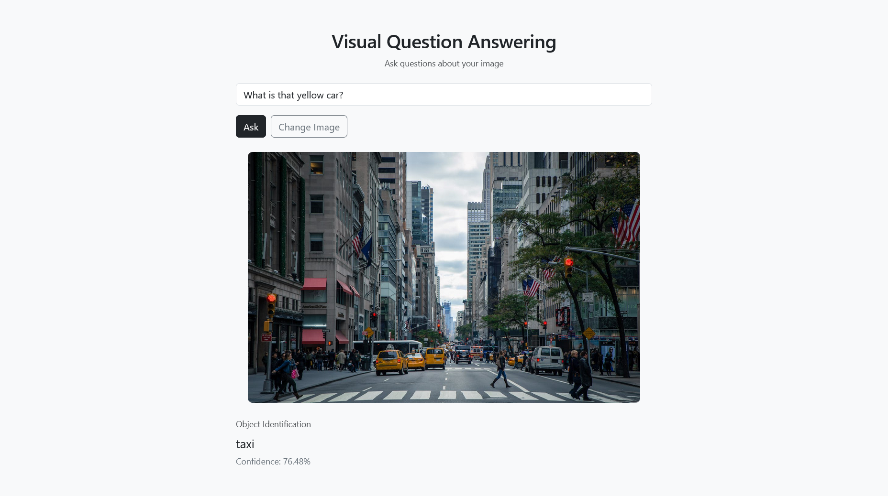

# Visual Question Answering (VQA) Inference Service

A production-ready multimodal AI system for answering natural language questions about images using BLIP (Bootstrapped Language Image Pretraining), Flask, and Docker.

This project demonstrates end-to-end vision-language model serving with structured validation, intent detection, REST API design, and production deployment using Gunicorn.


## 🔍 Overview

This application enables users to:

- Upload an image
- Ask a natural language question about the image
- Receive a structured response including:
  - Predicted answer
  - Confidence score (token-level probability)
  - Detected question type
  - Validation warnings (if applicable)

The system provides:

- A minimal Bootstrap-based web interface
- A REST API endpoint for programmatic access
- Dockerized deployment with production WSGI server
- Preloaded model weights for fast container startup


## 🧠 Core Capabilities

- BLIP-based Visual Question Answering
- Intent-aware question classification:
  - Counting
  - Color
  - Spatial
  - Yes/No
  - Object Identification
- Token-level confidence estimation from generation probabilities
- Rule-based answer validation layer
- Follow-up question support (session-based)
- REST API endpoint (`/api/vqa`)
- Production deployment using Gunicorn
- Dockerized (CPU-optimized PyTorch build)


## 🏗️ System Architecture

```

Client (Browser / API)
↓
Gunicorn (WSGI Server)
↓
Flask Application
↓
VQA Service Layer
↓
BLIP Vision-Language Model (PyTorch)
↓
Structured JSON Response

````

The architecture cleanly separates:

- Routing layer (`app.py`)
- Inference service (`services/`)
- Model wrapper (`models/`)
- Validation & preprocessing utilities (`utils/`)

This modular structure supports maintainability and production-style deployment.


## 📸 Application Preview

### Web Interface



# 🚀 Running with Docker (Recommended)

## Option 1 — Pull Prebuilt Image from Docker Hub (Fastest)

If you prefer not to build the image locally, you can pull the prebuilt image:

```bash
docker pull cybervamp/vqa-blip-cpu
````

Run the container:

```bash
docker run -p 5000:5000 cybervamp/vqa-blip-cpu
```

Open:

```
http://localhost:5000
```

## Option 2 — Build Image Locally

### Build

```bash
docker build -t vqa-blip .
```

### Run

```bash
docker run -p 5000:5000 vqa-blip
```

Open:

```
http://localhost:5000
```

### Production Details

* Gunicorn is used as the WSGI server
* BLIP model weights are pre-downloaded during image build
* No runtime model downloads
* CPU-only PyTorch build for portability


## 🔌 REST API

### Endpoint

```
POST /api/vqa
```

### Request (form-data)

| Key      | Type | Description               |
| -------- | ---- | ------------------------- |
| image    | File | Image file                |
| question | Text | Natural language question |

### Example (curl)

```bash
curl -X POST http://localhost:5000/api/vqa \
  -F "image=@dog.jpg" \
  -F "question=What animal is this?"
```

### Example Response

```json
{
  "answer": "dog",
  "confidence": 91.42,
  "question_type": "Object Identification",
  "is_valid": true,
  "warning": null
}
```

## 📂 Project Structure

```
├── datasets/
│   └── ok_vqa_stream.py
│
├── models/
│   └── blip_vqa.py
│
├── services/
│   └── inference.py
│
├── static/
│   └── uploads/
│       └── .gitkeep
│
├── templates/
│   └── index.html
│
├── utils/
│   ├── answer_validation.py
│   ├── image_utils.py
│   ├── question_type.py
│   └── question_utils.py
│
├── app.py
├── Dockerfile
├── requirements.txt
├── .dockerignore
└── .gitignore
```

## ⚙️ Technology Stack

* Python 3.10
* PyTorch
* Hugging Face Transformers
* BLIP Vision-Language Model
* Flask
* Gunicorn (WSGI server)
* Bootstrap 5
* Docker

## 📈 Engineering Highlights

* Confidence computed from token-level generation probabilities
* Intent-based validation to reduce hallucination risk
* Modular service-oriented backend structure
* Production-grade WSGI deployment with Gunicorn
* Dockerized with optimized CPU-only PyTorch build
* Preloaded model weights for fast startup
* Public Docker image for instant deployment
